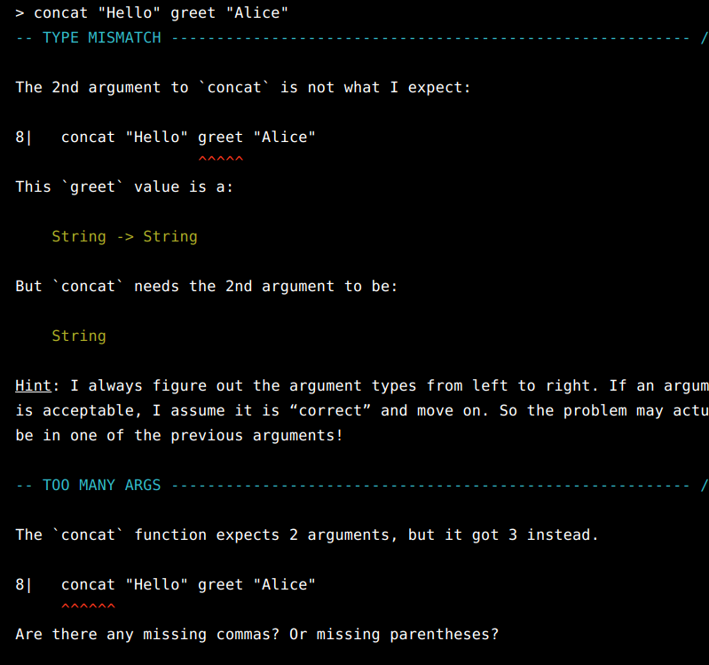
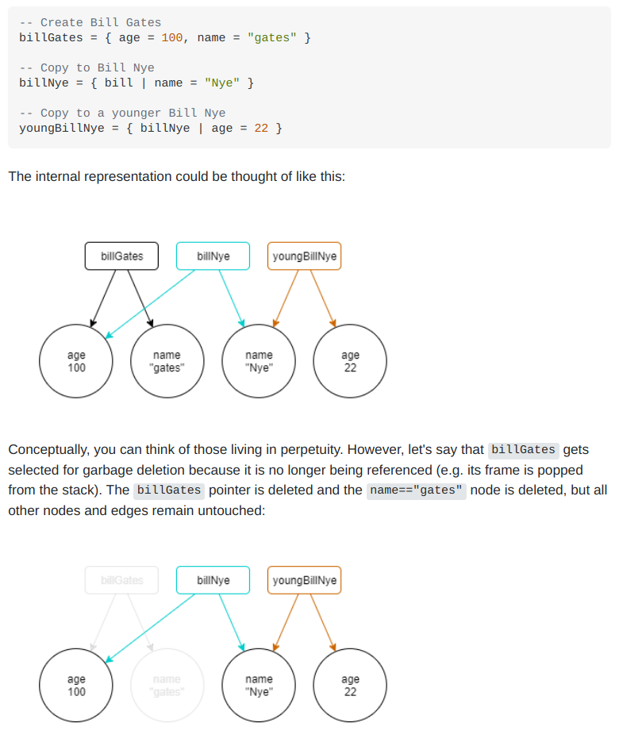

# Intro

## Summary

Elm is a **functional** language that **compiles to JavaScript**

- It is designed for web apps
- It emphasizes simplicity and good tooling

## Key Benefits

- No runtime errors
- Friendly error messages
- Reliable refactoring
- Enforced semantic versioning for all packages

# Core Language
Elm consists of **values** and **functions**. In the examples below, a `>` denotes code being executed in the console.

The smallest building blocks are values.
```elm
42
True
"Hello"!"
```

Functions are a way to **transform values**.
```elm
greet name =
    "Hello " ++ name ++ "!"
 
```

Functions can take many **arguments**.

```elm
concat first last =
    first ++ " " ++ last

> concat "Hello" (greet "Alice")
"Hello Hello Alice!"
```

Note the needed parentheses. Thankfully Elm provides helpful error messages if you forget:


There are also **if-expressions**:

```elm
greet timeOfDay =
   if timeOfDay == "morning" then
     "Good morning"
   else
     "Hello"
```

One of the most common data structures are **lists**. Unlike in JavaScript, they all must have the same type.

```elm
names = ["Alice", "Bob", "Chuck", "Dave", "Eve"]

> List.isEmpty names
False
> List.length names
5
> List.reverse names
["Eve","Dave","Chuck","Bob","Alice"]

numbers = [4, 2, 3, 1]

> List.sort numbers
[1,2,3,4]
> List.map (\n -> n+1) numbers
[5,3,4,2]
```

Elm also provides **tuples**. These allow you to contain any type, but only allow 2 or 3 values. Elm forces you to use **records** instead for larger collections of mismatched types. A common use-case is when returning multiple values from a function.

```elm
passwordValid password =
   if String.length password < 8 then
     (False, "Password not long enough")
   else
     (True, "Password accepted")
```

A **record** is like a hash in Ruby, a dictionary in Python,  or an object in JavaScript. It holds many values where each is associated with a name.

```elm
person = 
   { up = (\s -> String.toUpper s ++ "!")
   , name = "Bob"
   , job = "Plumber"
   }

> person.job
"Plumber"

> person.up person.job
"PLUMBER!"

-- Alternate access syntax
> .up person (.name person)
"BOB!"

--Updating a record
> { person | job = "Developer" }
{ job = "Developer", name = "Bob", up = <function> 
```

When updating that record, you might say "person where job is developer".  Note that it **returns a copy**. Elm makes this efficient by sharing as much data as possible.

https://stackoverflow.com/questions/46684628/updating-records-in-elm-what-happened-to-the-old-one



# The Elm Architecture

- **Model** — the state of your application
- **View** — a way to turn your state into HTML
- **Update** — a way to update your state based on messages

```elm
module Main exposing (..)

import Browser
import Html exposing (Html, button, div, text)
import Html.Events exposing (onClick)


-- MAIN
-- `main` is a special value in Elm.
-- It determines what gets rendered on screen.

-- Here we're creating a "sandboxed" element, isolated from the rest of the app.
-- `init`, `update`, and `view` are the names of functions that are expected inside
-- a record argument that `Browser.sandbox` expects. These functions respectively
-- initialize the element state, take user input, and render the element.
main =
  Browser.sandbox { init = init, update = update, view = view }


-- MODEL
-- Or otherwise known as state.
-- Elm places an emphasis on data modeling.

-- Type alias. 
-- Here we are describing the type of our state, which in this case is just a counter.
-- It is extremely common to use type aliases when designing a model, so that fields can
-- be added later without having to change any type annotations.
type alias Model = Int

-- Type annotation.
-- Elm can infer this information usually, but writing it explicitly improves error message
-- quality and serves as documentation. The compiler will ALWAYS verify that the annotations
-- are correct, so the "documentation" stays up to date.
init : Model
init =
  0
  
  
-- UPDATE
-- Here we define the "mesages" that our data model can receive. These will often
-- correspond to user interactions. The messages determine how to update the model state.

-- Custom type.
-- This is often a better way of modeling records with shared data, or variants, as custom 
--- types can have associated data attached to them.
type Msg
  = Increment
  | Decrement
  | Reset

update : Msg -> Model -> Model
update msg model =
  case msg of
    Increment ->
      model + 1
      
    Decrement ->
      model - 1

    Reset ->
      0

-- VIEW
-- This takes in the state as input and produces HTML.

view : Model -> Html Msg
view model =
  div []
    [ button [ onClick Decrement ] [ text "-" ]
    , div [] [ text (String.fromInt model) ]
    , button [ onClick Increment ] [ text "+" ]
    , button [ onClick Reset ] [ text "Reset" ]
    ]
```

